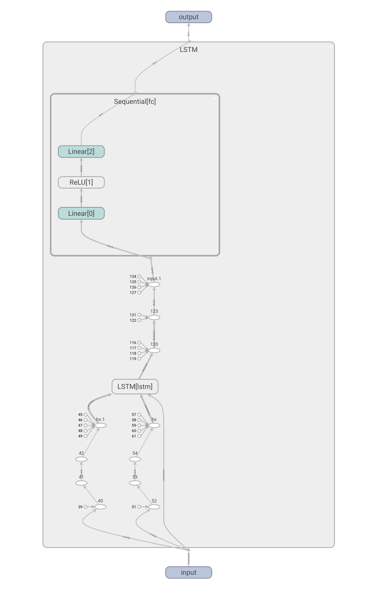

# LSTM Covid-19 Prediction Project

#### Arguments Info

```python
parser.add_argument('--data_name', type=str, required=True,
                    help='the data source name')
parser.add_argument('--data_path', type=str, required=True,
                    help='the data path to load')
parser.add_argument('--date_column', type=str, default='date',
                    help='the name of date column in data source')
parser.add_argument('--seq_len', type=int, default=7,
                    help='the sequence length of one sample, use first (seq_len - 1) to predict the last one')
parser.add_argument('--target', type=str, required=True,
                    help='the target column in data source to train and predict')
parser.add_argument('--checkpoints', type=str, default='./checkpoints/',
                    help='the model path to save')
parser.add_argument('--test_size', type=float, default=0.2,
                    help='the test size between (0, 1) to split the data source')
parser.add_argument('--log_dir', default='./log/',
                    help='the log dir of tensorboard')

parser.add_argument('--input_dim', type=int, default=1,
                    help='the input dim of the model')
parser.add_argument('--hidden_dim', type=int, default=64,
                    help='the hidden dim of the model')
parser.add_argument('--num_layers', type=int, default=4,
                    help='the number of layers in lstm')
parser.add_argument('--output_dim', type=int, default=1,
                    help='the output dim of the model')

parser.add_argument('--num_epochs', type=int, default=2000,
                    help='the number of epochs to train')
parser.add_argument('--lr', type=float, default=0.0001,
                    help='the learning rate')
parser.add_argument('--batch_size', type=int, default=8,
                    help='the batch size of data loader')

parser.add_argument('--use_gpu', action='store_true',
                    help='whether to use gpu')
```

#### Model Graph



Model input: (batch, seq_len-1, input_dim)

Model output: (batch, output_dim)

#### Train

```bash
python main.py 
--data_name covid19 
--data_path data/covid19.csv 
--target acc_confirm 
--use_gpu
```

To see the loss curve:

```bash
tensorboard --logdir=./log     
```

#### Prediction and plot

```bash
python prediction_plot.py 
--data_name covid19
--data_path ../data/covid19.csv
--target acc_confirm
--checkpoints ../checkpoints/
```

